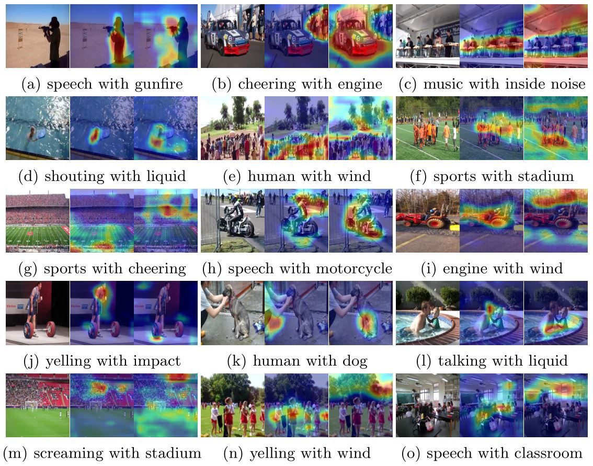
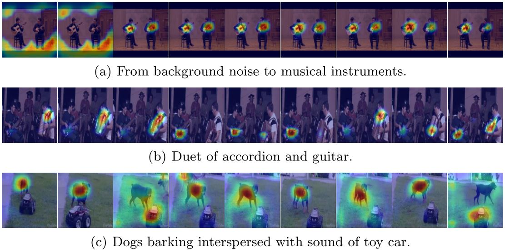
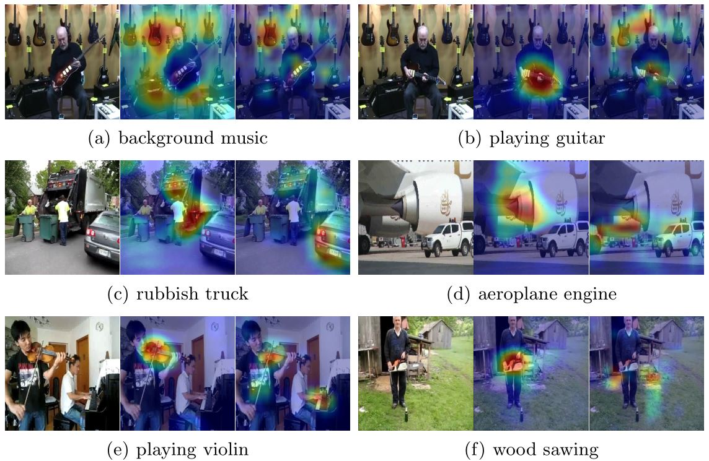

# Multi-Source-Sound-Localization

Code of ECCV paper [Multiple Sound Sources Localization from Coarse to Fine](https://arxiv.org/abs/2007.06355).

We have just uploaded the latest simplified version, which is much easier to use and reaches comparable performance with the original one, which is in the folder ```./new/``` in this repo.

This is a PyTorch implementation that aims to perform sound localization in complex audiovisual scenes, where there multiple objects making sounds. We disentangle a complex scene into several simple scenes consisting of one-to-one sound-object pairs.

We propose a two-stage learning framework, which establishes coarse-grained audiovisual correspondence in the category level at the first stage, and achieves fine-grained sound-object alignment at the second stage.

## Requirements

- PyTorch 1.1.0
- torchvision 0.3.0
- opencv 3.4.1
- librosa 0.7.0

## Prepare Dataset

The detailed preprocessing code and classification pseudo label generation can be referred to ```./prepare_data``` and ```./mobile_crnn/generate_data.py```. The pseudo labels for images are similar to the audio, but replace the model with ImageNet pretrained backbones, and use ```./utils/cluster_v3.npy``` for aggregation. And it is also practical to use the same pseudo labels for both images and audios, since the ImageNet labels cannot be well aligned with 7 general categories in AudioSet, introducing extra noise. There is only slight difference in the choice of label assignment. For datasets like AudioSet, directly use videos tags as classification labels.

#### SoundNet-Flickr Dataset

The audiovisual pairs are defined as one frame and a corresponding 5-second audio clip. We resize the image into $256\times 256$, sample the audio at $22050$ Hz, and convert it into log-mel spectrogram. We then convert the image and audio into hdf5 file format. We use the first-level labels in AudioSet for classification, and use pretrained CRNN and ResNet-18 to generate pseudo labels. The mapping from predictions to these 7 categories are stored in ```utils/cluster_a.npy``` and ```utils/cluster_v3.npy```.

#### AVE Dataset

There are totally 4143 10-second video clips available. We extract video frames at $1$ fps, and resize the images into $256\times 256$, sample the audio at $22050$ Hz, and convert it into log-mel spectrogram. We then convert the image and audio into hdf5 file format. We use the first-level labels in AudioSet for classification, and use pretrained CRNN and ResNet-18 to generate pseudo labels. The mapping from predictions to these 7 categories are stored in ```utils/cluster_a.npy``` and ```utils/cluster_v3.npy```.

#### AudioSet Instrument Dataset

This is a subset of AudioSet covering 15 music instruments. The video clips are annotated with labels that indicate which music instruments make sound in the audio.  We extract video frames at $1$ fps, and resize the images into $256\times 256$, sample the audio at $22050Hz$, and convert it into log-mel spectrogram. The video index and tags for training and testing are stored in train_audio.pkl and val_audio.pkl. And the bounding box annotations generated by Faster RCNN for evaluation are stored in normav.json in COCO format.

For unlabeled videos in SoundNet-Flickr and AVE dataset, it is optional to introduce class-agnostic proposals generated by Faster RCNN, and perform classification on each ROI region to improve the quality of pseudo labels.

## Procedure of the simplified version

The input data required is as follows:

- image RGB frame $N\times 3\times H\times W$
- audio spectrogram $N\times 1\times T\times F$
- audio (pseudo) label $N\times C$
- image (pseudo) label $N\times C$

#### Training 1st stage

```
cd new
python3 main.py --stage 1 --learning_rate 0.001
```

#### Training 2nd stage

```
cd new
python3 main.py --stage 2 --pretrained 1 --path path/to/1st-ckpt --learning_rate 0.0001
```

#### Evaluation

```
cd new
python3 main.py --evaluate 1 --pretrained 1 --path path/to/2nd-ckpt
```

## Results

#### Sound Localization on SoundNet-Flickr

We visualize the localization maps corresponding to different elements contained in the mixed sounds of two sources.



#### Sound Localization on AudioSet instrument

We visualize some examples in AudioSet with two categories of instruments making sound simultaneously. The localization maps in each subfigure are listed from left to right: AVC, Multi-task, Ours. The green boxes are detection results of Faster RCNN.


#### Spatio-temporal Sound Localization in Videos

We visualize the changes of localization maps in videos over time. The frames shown are extracted at 1 fps, the heatmaps show localization responses to corresponding 1-second audio clip. When only with noise, our model mainly focuses on background regions as the first two frames in Fig. (a). When there are sounds produced by specific objects, our model can accurately capture the sound makers, e.g., our model can distinguish sounds of guitar and accordion in Fig. (b), dog barking and toy-car sound in Fig. (c).



#### Comparison with CAM Baseline

We show some comparison between our model and CAM method. The images in each subfigure are listed as: original image, localization result of our model, result of CAM method. It is clear that CAM method cannot distinguish the objects belonging to the same category, e.g., violin and piano in Fig. (e), but our model can precisely localize the object that makes sound in input audio.



## Procedure of original code

### Training

#### Training 1st stage

For SoundNet-Flickr or AVE dataset, run 

```
./train_avc.sh
optional argumets:
[--train-batch] training batchsize
[--val-batch] validation batchsize
[--dataset] the name of dataset
[--mix] the number videos mixed per batch
[--frame] the number of frames in an audiovisual pair
[--lr] starting learning rate
[--schedule] epoch at which learning rate decay
[--resume] load checkpoint and continue training
```

For AudioSet dataset, run

```
./train_audioset_avc.sh
[--train-batch] training batchsize
[--val-batch] validation batchsize
[--dataset] the name of dataset
[--mix] the number videos mixed per batch
[--frame] the number of frames in an audiovisual pair
[--lr] starting learning rate
[--schedule] epoch at which learning rate decay
[--resume] load checkpoint and continue training
```

#### Training 2nd stage

For SoundNet-Flickr or AVE dataset, run 

```
./train_joint.sh
optional argumets:
[--train-batch] training batchsize
[--val-batch] validation batchsize
[--dataset] the name of dataset
[--mix] the number videos mixed per batch
[--frame] the number of frames in an audiovisual pair
[--lr] starting learning rate
[--schedule] epoch at which learning rate decay
[--resume] load checkpoint and continue training
```

For AudioSet dataset, run

```
./train_audioset_joint.sh
optional argumets:
[--train-batch] training batchsize
[--val-batch] validation batchsize
[--dataset] the name of dataset
[--mix] the number videos mixed per batch
[--frame] the number of frames in an audiovisual pair
[--lr] starting learning rate
[--schedule] epoch at which learning rate decay
[--resume] load checkpoint and continue training
```

The training log file and trained model are stored in

```
checkpoint/datasetName/log.txt
checkpoint/datasetName/model_avc.pth.tar
checkpoint/datasetName/model_joint.pth.tar
```

### Evaluate

For quantitative evaluation on human annotated SoundNet-Flickr, run

```
./eval.sh
```

It outputs cIoU and AUC result, and the visualization of localization maps.

For evaluation on AudioSet Instrument dataset, run

```
./eval_audioset.sh
```

It outputs class-specific localization maps on each sample stored in ```infer.npy```, then run

```
python3 utils/evaluate.py
```

to calculate evaluation results and visualize localization maps on different difficulty levels.

## Citation

```
@article{qian2020multiple,
  title={Multiple Sound Sources Localization from Coarse to Fine},
  author={Qian, Rui and Hu, Di and Dinkel, Heinrich and Wu, Mengyue and Xu, Ning and Lin, Weiyao},
  journal={arXiv preprint arXiv:2007.06355},
  year={2020}
}
```

